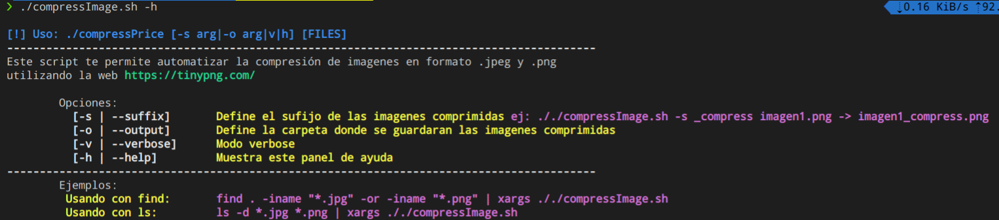

# compressImage

Esta herramienta escrita en bash le permite comprimir archivos **.png** y **.jpg** utilizando [TinyPNG](https://tinypng.com/)

 ***

**IMPORTANTE:** Para realizar la compresión puede auxiliarze de otros comandos como **ls** o **find**

### **¿Cómo funciona?**
El funcionamiento es sencillo. Basta con pasarle por parametros el archivo **.jpg** o **.png** y la herramienta generará como salida un archivo con el mismo nombre + ***"_compress"***  en su nombre.

<code>./compressImage.sh imagen1.png imagen2.jpg</code>

### **Opciones**
- ***-h|--help:*** Muestra el panel de ayuda de la app
- ***-v|--verbose:*** Muestra el trabajo en curso
- ***-o|output:*** Directorio donde se guardaran las imagenes comprimidas. Sino existe la herramienta lo va a crear
- ***-s|--sufix:*** Sufijo que se le agregará al nombre del archivo comprimido. Por defecto es ***_compres***

### **Ejemplos:**
Utilizando **ls**

<code>ls -d *.jpg *.png | xargs ././compressImage.sh</code> 

Utilizando **find**

<code>find . -iname "*.jpg" -or -iname "*.png" | xargs ./compressImage.sh</code>

### **Requisitos**
- curl
- Acceso a internet